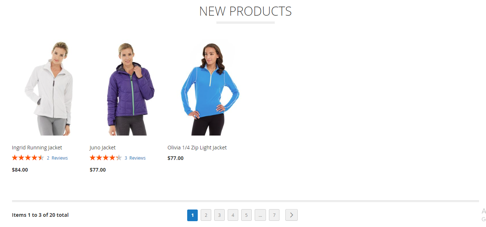

# Magento 2 New Products Extension

Enhance your Magento 2 store with the New Products Extension. This module offers advanced features to showcase new products effectively, with options for automatic or manual selection, sliders, and more.

**[New Products Extension for Magento 2](https://www.mavenbird.com/new-products-extension)** 

## Key Features:

- **Works with All Product Types:** 
  The extension is compatible with all types of products in Magento 2, including simple, configurable, grouped, and virtual products. This ensures that no matter what type of product you sell, you can feature new arrivals effortlessly.
  
- **Auto or Manual Product Selection:** 
  Choose between automatic and manual methods to display new products. You can either let the system automatically identify and display new products based on your configuration or manually select which products to feature, providing flexibility to suit your store’s needs.
  
- **Easy Configuration:** 
  Simplify the setup process with an intuitive configuration interface. Easily adjust settings to customize the appearance and behavior of new products on your store without needing complex coding or extensive technical knowledge.
  
- **Category-wise Filtering:** 
  Organize new products by categories for improved navigation and user experience. This feature allows you to filter and display new products specific to selected categories, helping customers find new arrivals in their areas of interest more efficiently.
  
- **Flexible Display Options:** 
  Display new products on any page of your Magento store using versatile code snippets or widgets. Whether you want to feature new products on the homepage, category pages, or any custom page, the extension provides the tools to do so with ease.
  
- **Multiple Store Views Supported:** 
  Manage and configure new product displays across different store views from a single installation. This feature is ideal for businesses with multiple store views or websites, ensuring consistent and effective product showcasing across various markets.

## Benefits:

- **Enhanced Product Visibility:** 
  Boost the visibility of new products with prominent displays and customizable settings. This helps in drawing attention to the latest additions and increases the likelihood of customer engagement.
  
- **Flexible Product Display:** 
  Utilize various display options, including sliders and category filters, to cater to different customer preferences and store layouts. This flexibility allows you to present new products in the most effective way for your store.
  
- **Streamlined Management:** 
  Manage new product displays effortlessly across multiple store views and categories. This streamlines operations and ensures consistent presentation of new products across different parts of your store.
  
- **Improved Customer Experience:** 
  Enhance the shopping experience by providing easy access to new products with clear headings, filtering options, and interactive elements like sliders. This improves customer satisfaction and encourages more frequent visits.

## Installation:
**Install via composer (recommended)**

Easy installation process with step-by-step instructions provided for hassle-free setup.
~~~~~~~~~~~~~~~~~~~~~~~~~~~~
composer require Mavenbird/new-products-extension
php bin/magento setup:upgrade
php bin/magento setup:static-content:deploy
php bin/magento setup:di:compile
php bin/magento cache:clean
~~~~~~~~~~~~~~~~~~~~~~~~~~~~

## Upgrade/Update Module:
Run the following command in Magento 2 root folder for easy update -
~~~~~~~~~~~~~~~~~~~~~
composer update Mavenbird/new-products-extension
php bin/magento setup:upgrade
php bin/magento setup:static-content:deploy
php bin/magento setup:di:compile
php bin/magento cache:clean
~~~~~~~~~~~~~~~~~~~~~

## Customization Options:
Customize shipping restriction settings with configurable templates and flexible configurations to match your store's needs.

**Example Configuration Screenshots:**

## Support:
For installation, customization, or any queries, our dedicated support team is available.
**Email: [support@mavenbird.com](support@mavenbird.com)** 

## Get Started:
Enhance your Magento 2 store with the New Products Extension to showcase new arrivals effectively. Utilize the extension's features to optimize product visibility and improve customer engagement.

**Thank you!**